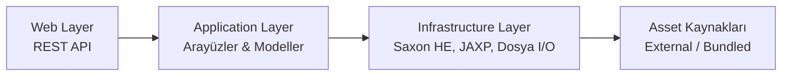
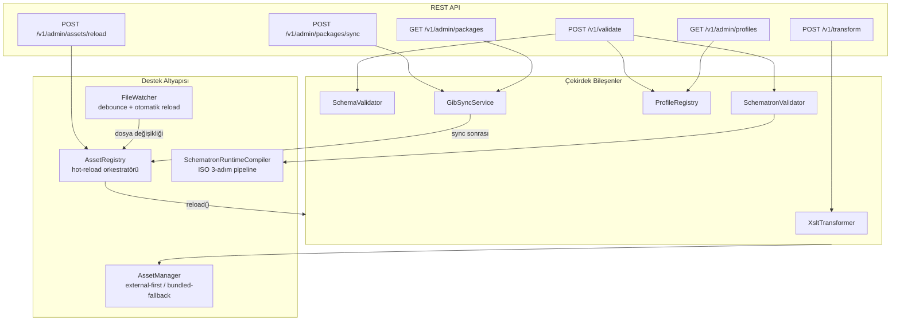
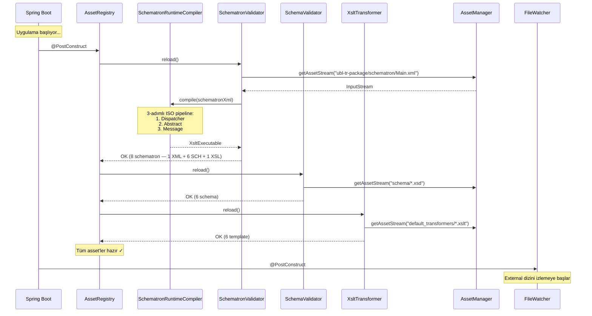
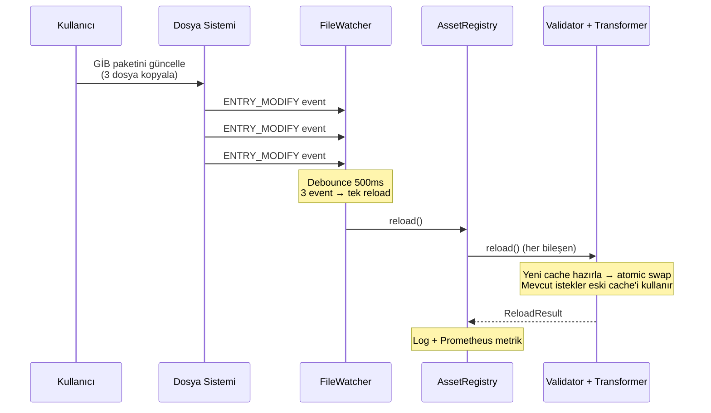
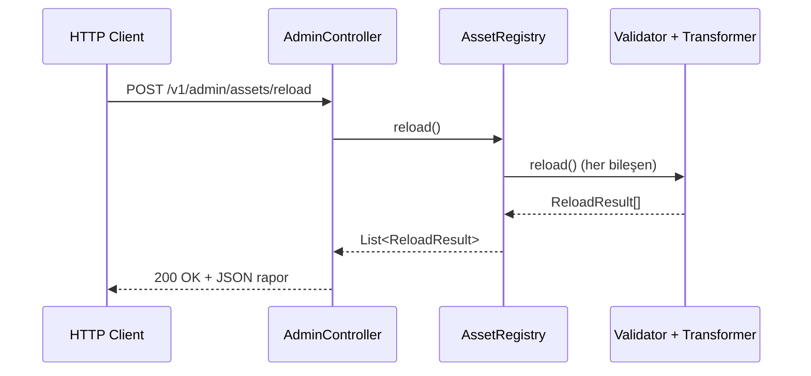
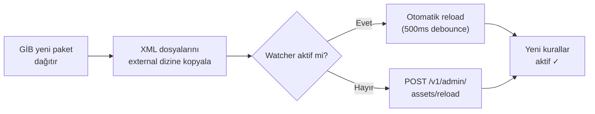
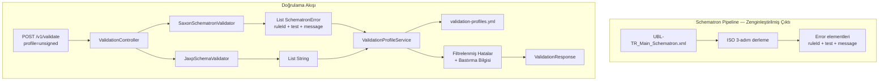
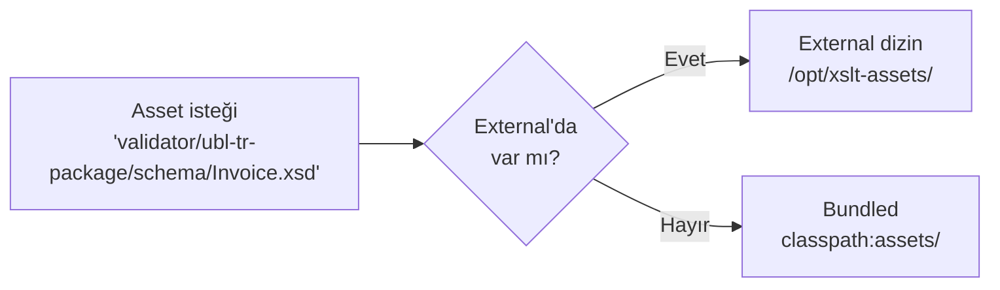
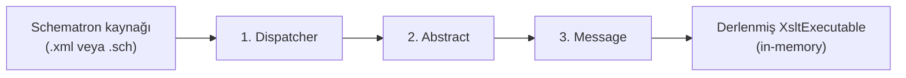
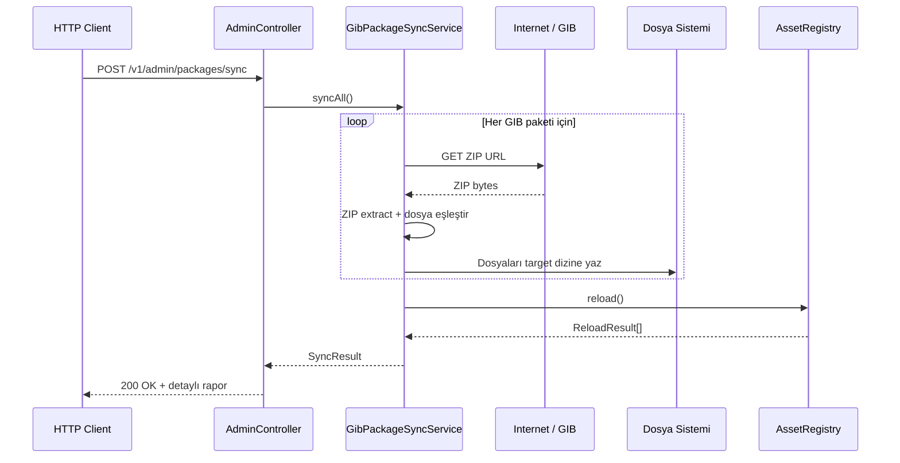

# MERSEL.Services.XsltService

Saxon HE motoru ile XML Schema/Schematron doğrulama ve XSLT dönüşüm mikro servisi.

## Genel Bakış

E-Fatura, E-İrsaliye, E-Arşiv ve diğer e-dönüşüm belgeleri için XML doğrulama ve HTML dönüşüm servisi sunar. Java 21 + Spring Boot 3.4 üzerine inşa edilmiştir.

### Temel Özellikler

| Özellik | Açıklama |
|---------|----------|
| **XML Schema (XSD) Doğrulama** | 6 belge tipi: Invoice, DespatchAdvice, ReceiptAdvice, CreditNote, FreelancerVoucher, EArchiveReport |
| **Schematron Doğrulama** | 8 tip: UBL-TR Main, EArchive Report, E-Defter Yevmiye/Kebir/Berat/Rapor + Envanter Berat/Defter |
| **XSLT Dönüşüm** | 6 belge tipi: Invoice, ArchiveInvoice, DespatchAdvice, ReceiptAdvice, EMM, ECheck |
| **Otomatik Belge Tipi Tespiti** | XML root element'inden belge türünü (Invoice, DespatchAdvice vb.) SAX parser ile otomatik algılar — doğrulamada manuel tip seçimi opsiyonel |
| **Gömülü XSLT Desteği** | Belge içindeki `EmbeddedDocumentBinaryObject` XSLT'yi otomatik çıkar ve kullan |
| **Runtime Schematron Derleme** | GİB UBL-TR Schematron XML'leri ve e-Defter .sch dosyalarından XSLT'yi başlangıçta otomatik derler |
| **Doğrulama Profilleri** | İmzasız belge doğrulama, kural bastırma — YAML ile yapılandırılabilir profil sistemi |
| **API Rate Limiting** | IP bazlı dakika penceresi rate limiting — endpoint grubu başına ayrı limit, reverse proxy desteği |
| **Production Profili** | `SPRING_PROFILES_ACTIVE=prod` ile varsayılan admin şifresi reddi, Springdoc kapatma, log seviyesi ayarları |
| **Hot-Reload** | Dosya değişikliğinde veya API ile yeniden yükleme — restart gerekmez |
| **External Asset Override** | XSD, XSLT, Schematron dosyalarını Docker volume mount ile dışarıdan besle |
| **Web Arayüzü** | React + TailwindCSS + shadcn/ui — doğrulama, dönüşüm, profil ve admin arayüzü (JAR'a gömülü veya ayrı) |
| **GİB Paket Otomatik Sync** | GİB resmi paketlerini (e-Fatura, UBL-TR XSD, e-Arşiv, e-Defter) API ile indir ve güncelle |
| **XSD Hata İnsanlaştırma** | JAXP teknik hata mesajlarını Türkçe okunabilir açıklamalara dönüştürme (15+ hata kalıbı) |
| **Kimlik Doğrulama** | Token tabanlı admin auth — env'den yapılandırılabilir kullanıcı adı & parola |
| **Güvenlik Başlıkları** | CSP, X-Frame-Options, X-Content-Type-Options, Referrer-Policy, Permissions-Policy |
| **Filigran** | Dönüştürülmüş HTML'e otomatik filigran ekleme |

## Teknoloji

| Bileşen | Teknoloji |
|---------|-----------|
| Runtime | Java 21 (LTS) |
| Framework | Spring Boot 3.4 |
| XSLT Motor | Saxon HE 12.x (XSLT 3.0 / XPath 3.1) |
| XSD Doğrulama | JAXP (`javax.xml.validation`) |
| API Dokümantasyonu | SpringDoc OpenAPI + Scalar UI |
| Metrikler | Micrometer + Prometheus |
| Build | Gradle 8.12 (Kotlin DSL, multi-module) |
| Test | JUnit 5 + AssertJ + Mockito + MockMvc + JaCoCo |
| Container | Docker (multi-stage, JRE Alpine) |
| CI/CD | GitHub Actions |

## Mimari

### Katman Genel Bakış



### API Endpoint'leri ve Bileşenler



## Çalışma Akışı

### Startup — Otomatik Derleme ve Yükleme

Servis başlarken tüm asset'leri otomatik derler ve önbelleğe alır. Manuel bir adım gerekmez.



### Hot-Reload — Dosya Değişikliğinde Otomatik Güncelleme

External dizindeki dosyalar değiştiğinde servis otomatik olarak yeniden yükler. Mevcut istekler etkilenmez (atomic swap).



### Manuel Reload — API ile Tetikleme



### GİB Paket Güncelleme Akışı

GİB yeni UBL-TR Schematron paketi dağıttığında:



## Hızlı Başlangıç

### Gereksinimler

- **Java 21** (JDK)
- **Docker** (opsiyonel, container çalıştırmak için)

### Yerel Geliştirme

```bash
# Projeyi klonla
git clone https://github.com/mersel-os/ebelge-xslt-service.git
cd ebelge-xslt-service

# Derle ve test et
./gradlew build

# Çalıştır — Schematron otomatik derlenir, hazır!
./gradlew :xslt-web-api:bootRun
```

Servis adresleri:
- **API:** http://localhost:8080
- **Scalar UI:** http://localhost:8080/scalar.html
- **Health:** http://localhost:8080/actuator/health
- **Prometheus Metrikleri:** http://localhost:8080/actuator/prometheus

### Docker ile Çalıştırma

```bash
# Build ve çalıştır
docker compose up --build

# Veya sadece image oluştur
docker build -t mersel-xslt-service .
docker run -p 8080:8080 mersel-xslt-service
```

### Docker + External Asset ile Çalıştırma

```bash
# custom-assets dizininde override dosyalarınız olsun
docker run -p 8080:8080 \
  -v $(pwd)/custom-assets:/opt/xslt-assets:ro \
  -e XSLT_ASSETS_EXTERNAL_PATH=/opt/xslt-assets \
  -e XSLT_ASSETS_WATCH_ENABLED=true \
  mersel-xslt-service
```

## API Kullanımı

### XML Doğrulama

```bash
# Otomatik belge tipi tespiti ile (önerilen — schemaValidationType opsiyonel)
curl -X POST http://localhost:8080/v1/validate \
  -F "source=@fatura.xml" \
  -F "schematronValidationType=UBLTR_MAIN" \
  -F "ublTrMainSchematronType=efatura"
# → DocumentTypeDetector XML root element'inden INVOICE tipini otomatik algılar

# Manuel belge tipi belirterek
curl -X POST http://localhost:8080/v1/validate \
  -F "source=@fatura.xml" \
  -F "schemaValidationType=INVOICE" \
  -F "schematronValidationType=UBLTR_MAIN" \
  -F "ublTrMainSchematronType=efatura"
```

> **Not:** `schemaValidationType` parametresi gönderilmezse, servis XML root element'ini SAX parser ile okuyarak belge tipini otomatik tespit eder (`Invoice` → `INVOICE`, `DespatchAdvice` → `DESPATCH_ADVICE` vb.).

**Yanıt:**
```json
{
  "result": {
    "validSchema": true,
    "validSchematron": false,
    "schemaValidationErrors": [],
    "schematronValidationErrors": [
      {
        "ruleId": "XadesSignatureCheck",
        "test": "ds:KeyInfo",
        "message": "ds:KeyInfo elemani zorunlu bir elemandir."
      },
      {
        "ruleId": "UBLVersionIDCheck",
        "test": "cbc:UBLVersionID = '2.1'",
        "message": "Gecersiz cbc:UBLVersionID elemani degeri..."
      }
    ]
  }
}
```

#### Profil ile Doğrulama (İmzasız Belge)

```bash
# "unsigned" profili — imza kontrollerini bastırır
curl -X POST http://localhost:8080/v1/validate \
  -F "source=@fatura.xml" \
  -F "schemaValidationType=INVOICE" \
  -F "schematronValidationType=UBLTR_MAIN" \
  -F "profile=unsigned"
```

**Yanıt (bastırma bilgisi dahil):**
```json
{
  "result": {
    "validSchema": true,
    "validSchematron": false,
    "schemaValidationErrors": [],
    "schematronValidationErrors": [
      {
        "ruleId": "UBLVersionIDCheck",
        "test": "cbc:UBLVersionID = '2.1'",
        "message": "Gecersiz cbc:UBLVersionID elemani degeri..."
      }
    ],
    "suppressionInfo": {
      "profile": "unsigned",
      "totalRawErrors": 4,
      "suppressedCount": 3,
      "suppressedErrors": [
        {
          "ruleId": "XadesSignatureCheck",
          "test": "ds:KeyInfo",
          "message": "ds:KeyInfo elemani zorunlu bir elemandir."
        },
        {
          "ruleId": "SignatureCheck",
          "test": "cac:Signature",
          "message": "cac:Signature elemani zorunlu."
        }
      ]
    }
  }
}
```

#### Profil + Ad-hoc Bastırma

```bash
# "unsigned" profili + InvoiceIDCheck'i de bastır
curl -X POST http://localhost:8080/v1/validate \
  -F "source=@fatura.xml" \
  -F "schemaValidationType=INVOICE" \
  -F "schematronValidationType=UBLTR_MAIN" \
  -F "profile=unsigned" \
  -F "suppressions=InvoiceIDCheck"
```

#### Profilleri Listele

```bash
curl http://localhost:8080/v1/admin/profiles
```

### XSLT Dönüşüm

Başarılı dönüşümde **ham HTML** döner (`text/html`). Metadata, response header'larından okunur.

**XSLT Seçim Önceliği:**
1. `transformer` dosyası yüklendiyse → onu kullan
2. `useEmbeddedXslt=true` ve belgede gömülü XSLT varsa → belgeden çıkar ve kullan
3. Hiçbiri yoksa → varsayılan XSLT şablonu

```bash
# Varsayılan XSLT ile
curl -v -X POST http://localhost:8080/v1/transform \
  -F "document=@fatura.xml" \
  -F "transformType=INVOICE"

# Belgenin kendi gömülü XSLT'si ile (UBL-TR belgelerinde yaygın)
curl -v -X POST http://localhost:8080/v1/transform \
  -F "document=@fatura.xml" \
  -F "transformType=INVOICE" \
  -F "useEmbeddedXslt=true"

# Özel XSLT + filigran ile
curl -v -X POST http://localhost:8080/v1/transform \
  -F "document=@fatura.xml" \
  -F "transformType=INVOICE" \
  -F "transformer=@ozel-sablon.xslt" \
  -F "watermarkText=TASLAK"
```

**Başarılı Yanıt (200 OK):**
```
HTTP/1.1 200 OK
Content-Type: text/html;charset=utf-8
X-Xslt-Default-Used: false
X-Xslt-Duration-Ms: 145
X-Xslt-Watermark-Applied: true
X-Xslt-Output-Size: 45678

<html>...<body>...fatura içeriği...</body></html>
```

**Hata Yanıtı (422 — RFC 7807):**
```json
{
  "type": "https://mersel.io/xslt/errors/transform-failed",
  "title": "Dönüşüm Başarısız",
  "status": 422,
  "detail": "XML belgesi dönüştürülemedi: malformed content"
}
```

#### Response Header'ları

| Header | Tip | Açıklama |
|--------|-----|----------|
| `X-Xslt-Default-Used` | boolean | Varsayılan XSLT şablonu kullanıldı mı |
| `X-Xslt-Embedded-Used` | boolean | Belgeden çıkarılan gömülü XSLT kullanıldı mı |
| `X-Xslt-Custom-Error` | string | Özel/gömülü XSLT hata mesajı (sadece fallback durumunda) |
| `X-Xslt-Duration-Ms` | integer | İşlem süresi (milisaniye) |
| `X-Xslt-Watermark-Applied` | boolean | Filigran uygulandı mı |
| `X-Xslt-Output-Size` | integer | Çıktı boyutu (byte) |

### Asset Yeniden Yükleme

```bash
curl -X POST http://localhost:8080/v1/admin/assets/reload
```

**Yanıt:**
```json
{
  "reloadedAt": "2026-02-08T21:00:00Z",
  "durationMs": 1280,
  "components": [
    { "name": "Schematron Rules", "status": "OK", "count": 8, "durationMs": 890, "errors": [] },
    { "name": "XSD Schemas", "status": "OK", "count": 6, "durationMs": 210, "errors": [] },
    { "name": "XSLT Templates", "status": "OK", "count": 5, "durationMs": 150, "errors": [] },
    { "name": "Validation Profiles", "status": "OK", "count": 2, "durationMs": 30, "errors": [] }
  ]
}
```

## Desteklenen Doğrulama Tipleri

### Schema (XSD)

| Tip | Açıklama |
|-----|----------|
| `INVOICE` | UBL 2.1 Fatura |
| `DESPATCH_ADVICE` | UBL 2.1 İrsaliye |
| `RECEIPT_ADVICE` | UBL 2.1 İrsaliye Yanıt |
| `CREDIT_NOTE` | UBL 2.1 Müstahsil Makbuzu |
| `FREELANCER_VOUCHER` | UBL 2.1 Serbest Meslek Makbuzu |
| `EARCHIVE_REPORT` | E-Arşiv Rapor |

### Schematron

| Tip | Kaynak | Açıklama |
|-----|--------|----------|
| `UBLTR_MAIN` | Runtime derleme (XML) | UBL-TR Ana Schematron (ubl-tr-package'dan otomatik derlenir) |
| `EARCHIVE_REPORT` | Pre-compiled XSL | E-Arşiv Rapor Schematron |
| `EDEFTER_YEVMIYE` | Runtime derleme (SCH) | E-Defter Yevmiye |
| `EDEFTER_KEBIR` | Runtime derleme (SCH) | E-Defter Kebir |
| `EDEFTER_BERAT` | Runtime derleme (SCH) | E-Defter Berat |
| `EDEFTER_RAPOR` | Runtime derleme (SCH) | E-Defter Rapor |
| `ENVANTER_BERAT` | Runtime derleme (SCH) | Envanter Berat |
| `ENVANTER_DEFTER` | Runtime derleme (SCH) | Envanter Defter |

> **Not:** `_DS` (Dijital İmza) varyantları kaldırıldı. İmza kontrollerini bastırmak için `profile=unsigned` kullanın.

### Dönüşüm

| Tip | Açıklama |
|-----|----------|
| `INVOICE` | E-Fatura |
| `ARCHIVE_INVOICE` | E-Arşiv Fatura |
| `DESPATCH_ADVICE` | E-İrsaliye |
| `RECEIPT_ADVICE` | E-İrsaliye Yanıt |
| `EMM` | E-Müstahsil Makbuzu |
| `ECHECK` | E-Çek |

## Doğrulama Profilleri

Doğrulama profilleri, belirli Schematron/XSD hatalarının bastırılmasını (suppression) sağlar. Yaygın kullanım: imzasız belgelerin doğrulanması.

### Nasıl Çalışır



### Profil Türleri

| Profil | Açıklama |
|--------|----------|
| `signed` | Tam doğrulama — tüm kontroller aktif, bastırma yok |
| `unsigned` | İmzasız belge — imza kontrolleri bastırılıyor |
| *(özel)* | Kendi profiliniz — `extends` ile mevcut profillerden miras alabilir |

### Bastırma Modları

Profiller üç eşleşme modunu destekler:

| Mod | Hedef | Kararlılık | Kullanım |
|-----|-------|------------|----------|
| `ruleId` | Soyut kural kimliği (örn: `InvoiceIDCheck`) | En yüksek | Runtime derlenen Schematron'lar |
| `test` | XPath test ifadesi (örn: `matches(cbc:ID,...)`) | Yüksek | Runtime derlenen Schematron'lar |
| `text` | Hata mesajı metni (örn: `.*[Ii]mza.*`) | Orta | Pre-compiled XSL'ler (fallback) |

### Profil YAML Yapısı

```yaml
profiles:
  unsigned:
    description: "Imzasiz belge dogrulama"
    suppressions:
      - match: ruleId
        pattern: "XadesSignatureCheck"
        description: "XAdES imza kontrolu"
      - match: ruleId
        pattern: "SignatureCheck"
      - match: text
        pattern: ".*[Ii]mza.*"
        description: "Text fallback"

  my-company:
    extends: unsigned          # unsigned'ın tüm kurallarını miras al
    description: "Firma ozel profili"
    suppressions:
      - match: ruleId
        pattern: "InvoiceIDCheck"
```

### Özel Profil Ekleme

1. `custom-assets/validation-profiles.yml` dosyasını oluşturun (bkz: `custom-assets.example/`)
2. Profil tanımlayın — `extends` ile mevcut profillerden miras alabilirsiniz
3. Servis yeniden yüklendiğinde otomatik algılanır (hot-reload)
4. `POST /v1/validate` isteğinde `profile=my-company` parametresi ile kullanın

### Mevcut Schematron Kural Kimlikleri (ruleId)

GİB `UBL-TR_Common_Schematron.xml` dosyasındaki başlıca soyut kural kimlikleri:

| ruleId | Açıklama |
|--------|----------|
| `XadesSignatureCheck` | XAdES imza kontrolü |
| `XadesSignatureCheckForInvoice` | Fatura XAdES imza kontrolü |
| `SignatureCountCheck` | İmza sayısı kontrolü |
| `SignatureCheck` | İmza varlık kontrolü |
| `SignatureMethodCheck` | İmza metodu kontrolü |
| `SignatoryPartyPartyIdentificationCheck` | İmzacı taraf kimlik kontrolü |
| `InvoiceIDCheck` | Fatura ID format kontrolü |
| `UBLVersionIDCheck` | UBL versiyon kontrolü |
| `TransformCountCheck` | Transform sayısı kontrolü |
| `X509DataCheck` | X509 sertifika veri kontrolü |
| `X509SubjectNameCheck` | X509 konu adı kontrolü |

## External Asset Yapılandırması

Servisin kullandığı XSD, XSLT ve Schematron dosyaları dışarıdan beslenebilir. External dizinde bulunan dosyalar önceliklidir; bulunmayanlar için dahili (bundled) versiyonlar kullanılır.

### Nasıl Çalışır



### Yapılandırma

| Parametre | Env Variable | Varsayılan | Açıklama |
|-----------|-------------|------------|----------|
| `xslt.assets.external-path` | `XSLT_ASSETS_EXTERNAL_PATH` | (boş) | External asset dizini |
| `xslt.assets.watch-enabled` | `XSLT_ASSETS_WATCH_ENABLED` | `true` | Dosya değişikliği izleme |
| `xslt.assets.watch-debounce-ms` | `XSLT_ASSETS_WATCH_DEBOUNCE_MS` | `500` | Debounce süresi (ms) |

### Override Edilebilir Dosya Yapısı

```
custom-assets/
├── default_transformers/              # Varsayılan HTML dönüşüm XSLT'leri
│   ├── eInvoice_Base.xslt
│   ├── eArchive_Base.xslt
│   └── ...
├── validator/
│   ├── ubl-tr-package/                # UBL-TR paket dosyaları
│   │   ├── schematron/                # GİB kaynak Schematron XML'leri
│   │   │   ├── UBL-TR_Main_Schematron.xml
│   │   │   ├── UBL-TR_Common_Schematron.xml
│   │   │   └── UBL-TR_Codelist.xml
│   │   └── schema/                    # UBL-TR XSD dosyaları
│   │       ├── common/                # Ortak UBL XSD'ler
│   │       └── maindoc/               # Belge tipi XSD'ler
│   ├── earchive/                      # e-Arşiv dosyaları
│   │   ├── schematron/                # earsiv_schematron.xsl
│   │   └── schema/                    # e-Arşiv XSD dosyaları
│   └── eledger/                       # e-Defter dosyaları
│       ├── schematron/                # E-Defter Schematron (.sch) dosyaları
│       └── schema/                    # E-Defter XSD dosyaları
```

Örnek yapı için `custom-assets.example/` dizinine bakın.

### Schematron Runtime Derleme

Serviste ayrı bir CLI veya build adımı yoktur. Schematron kaynak dosyaları başlangıçta otomatik olarak ISO 3-adımlı pipeline ile XSLT'ye derlenir:

- **Source XML** — UBL-TR Schematron XML'leri (UBL-TR_Main_Schematron.xml)
- **Source SCH** — GİB e-Defter ISO Schematron (.sch) dosyaları (6 dosya)



**GİB paket güncellemesi (manuel):**

1. Yeni `ubl-tr-package/schematron/` dosyalarını external dizine kopyala
2. Servis otomatik algılar ve yeniden derler (watcher aktifse)
3. Veya `POST /v1/admin/assets/reload` çağır
4. Restart gerekmez

**GİB paket güncellemesi (otomatik sync):**

GİB paket sync API ile tek komutla tüm paketler güncellenebilir:
```bash
curl -X POST http://localhost:8080/v1/admin/packages/sync
```

### GİB Paket Otomatik Sync

GİB resmi web sitesinden e-Fatura, UBL-TR XSD, e-Arşiv ve e-Defter paketlerini indirir, ZIP'ten çıkartır ve asset dizinine yerleştirir.



#### Desteklenen Paketler

| Paket | URL | Çıkarılacak Dosyalar | Hedef Dizin |
|-------|-----|---------------------|-------------|
| UBL-TR Şematron | `ebelge.gib.gov.tr/.../e-FaturaPaketi.zip` | `schematron/*.xml` | `validator/ubl-tr-package/schematron/` |
| UBL-TR XSD | `ebelge.gib.gov.tr/.../UBL-TR1.2.1_Paketi.zip` | `xsdrt/common/*.xsd`, `xsdrt/maindoc/*.xsd` | `validator/ubl-tr-package/schema/common/`, `validator/ubl-tr-package/schema/maindoc/` |
| e-Arşiv | `ebelge.gib.gov.tr/.../earsiv_paket_v1.1_6.zip` | `*.xsl`, `*.xsd` | `validator/earchive/schematron/`, `validator/earchive/schema/` |
| e-Defter | `edefter.gov.tr/.../e-Defter_Paketi.zip` | `sch/*.sch`, `xsd/**/*.xsd` | `validator/eledger/schematron/`, `validator/eledger/schema/` |

#### Sync API Kullanımı

```bash
# Tüm paketleri sync et
curl -X POST http://localhost:8080/v1/admin/packages/sync

# Belirli bir paketi sync et
curl -X POST http://localhost:8080/v1/admin/packages/sync?package=efatura

# Paket listesini gör
curl http://localhost:8080/v1/admin/packages
```

**Başarılı sync yanıtı:**
```json
{
  "enabled": true,
  "syncedAt": "2026-02-08T21:00:00Z",
  "totalDurationMs": 5400,
  "successCount": 4,
  "totalCount": 4,
  "currentAssetSource": "external",
  "packages": [
    {
      "packageId": "efatura",
      "displayName": "UBL-TR Şematron Paketi",
      "success": true,
      "filesExtracted": 3,
      "extractedFiles": [
        "validator/ubl-tr-package/schematron/UBL-TR_Main_Schematron.xml",
        "validator/ubl-tr-package/schematron/UBL-TR_Common_Schematron.xml",
        "validator/ubl-tr-package/schematron/UBL-TR_Codelist.xml"
      ],
      "durationMs": 1200
    }
  ]
}
```

**Sync devre dışı yanıtı:**
```json
{
  "enabled": false,
  "message": "GIB paket sync ozelligi devre disi. Etkinlestirmek icin VALIDATION_ASSETS_GIB_SYNC_ENABLED=true ayarlayin.",
  "currentAssetSource": "bundled"
}
```

#### Yapılandırma

| Parametre | Env Variable | Varsayılan | Açıklama |
|-----------|-------------|------------|----------|
| `validation-assets.gib.sync.enabled` | `VALIDATION_ASSETS_GIB_SYNC_ENABLED` | `true` | Sync özelliğini aç/kapa |
| `validation-assets.gib.sync.target-path` | `VALIDATION_ASSETS_GIB_SYNC_PATH` | (boş) | İndirilen dosyaların hedef dizini (boşsa `xslt.assets.external-path` kullanılır) |
| `validation-assets.gib.sync.connect-timeout-ms` | — | `10000` | HTTP bağlantı zaman aşımı (ms) |
| `validation-assets.gib.sync.read-timeout-ms` | — | `60000` | HTTP okuma zaman aşımı (ms) |

#### Docker ile GİB Sync

```bash
# External path ile GİB sync
docker run -p 8080:8080 \
  -v $(pwd)/gib-assets:/opt/xslt-assets \
  -e XSLT_ASSETS_EXTERNAL_PATH=/opt/xslt-assets \
  -e VALIDATION_ASSETS_GIB_SYNC_ENABLED=true \
  mersel-xslt-service

# Sync tetikle
curl -X POST http://localhost:8080/v1/admin/packages/sync
```

#### Sync'i Devre Dışı Bırakma

GİB sync tamamen kapatılıp sadece kullanıcının sağladığı dosyalar kullanılabilir:

```bash
docker run -p 8080:8080 \
  -v $(pwd)/custom-assets:/opt/xslt-assets:ro \
  -e XSLT_ASSETS_EXTERNAL_PATH=/opt/xslt-assets \
  -e VALIDATION_ASSETS_GIB_SYNC_ENABLED=false \
  mersel-xslt-service
```

Bu durumda sync endpoint'i `200 OK` ile açıklayıcı bir yanıt döner (bkz: yukarıdaki "Sync devre dışı yanıtı").

## Monitoring

Prometheus + Grafana monitoring stack:

```bash
cd monitoring
docker compose up -d
```

| Servis | Adres |
|--------|-------|
| Prometheus | http://localhost:9090 |
| Grafana | http://localhost:3000 (admin/admin) |

### Özel Metrikler

**Doğrulama:**

| Metrik | Tip | Etiketler | Açıklama |
|--------|-----|-----------|----------|
| `xslt_validations_total` | Counter | `type`, `document_type`, `result` | Doğrulama sayısı (tip / belge / sonuç bazlı) |
| `xslt_validation_total` | Counter | `schema_type`, `schematron_type` | Doğrulama istek sayısı (şema tipi bazlı) |
| `xslt_validation_duration` | Timer | `type`, `document_type` | Doğrulama süresi |
| `xslt_validation_errors_total` | Counter | `type` | Doğrulama hata sayısı (schema / schematron) |
| `xslt_document_type_validations_total` | Counter | `document_type`, `result` | Belge tipine göre doğrulama dağılımı |
| `xslt_profile_usage_total` | Counter | `profile` | Bastırma profili kullanım sayısı |
| `xslt_suppressed_errors_total` | Counter | `profile` | Profil ile bastırılan hata sayısı |

**Dönüşüm:**

| Metrik | Tip | Etiketler | Açıklama |
|--------|-----|-----------|----------|
| `xslt_transforms_total` | Counter | `transform_type`, `custom_xslt`, `default_used` | Dönüşüm sayısı (tip / kaynak bazlı) |
| `xslt_transform_duration` | Timer | `transform_type` | Dönüşüm süresi |
| `xslt_transform_output_bytes` | Summary | `transform_type` | Çıktı boyutu (byte) |
| `xslt_embedded_xslt_total` | Counter | `result` | Gömülü XSLT kullanım sonuçları |

**Güvenlik:**

| Metrik | Tip | Etiketler | Açıklama |
|--------|-----|-----------|----------|
| `xslt_rate_limit_exceeded_total` | Counter | `endpoint` | Rate limit aşım sayısı (validate / transform) |
| `xslt_auth_login_total` | Counter | `result` | Giriş denemesi sayısı (success / failure / blocked) |

**Operasyon:**

| Metrik | Tip | Etiketler | Açıklama |
|--------|-----|-----------|----------|
| `xslt_asset_reload_total` | Counter | `status` | Asset reload sayısı |
| `xslt_asset_reload_duration_seconds` | Timer | — | Asset reload süresi |
| `xslt_gib_sync_total` | Counter | `status` | GİB paket sync sayısı |
| `xslt_gib_sync_duration_seconds` | Timer | — | GİB sync süresi |
| `xslt_schematron_compilations_total` | Counter | — | Schematron derleme sayısı |
| `xslt_schematron_compilation_duration` | Timer | — | Schematron derleme süresi |
| `xslt_errors_total` | Counter | `operation` | Genel hata sayısı (işlem bazlı) |
| `xslt_xsd_override_cache_size` | Gauge | — | XSD override önbellek boyutu |

### Grafana Dashboard

Dashboard 6 bölüm içerir (30+ panel):

1. **Genel Bakış** — Servis durumu, toplam doğrulama/dönüşüm/hata, rate limit aşımı, profil kullanımı, JVM heap, XSD cache boyutu
2. **Doğrulama Metrikleri** — İstek hızı, süre (p95), belge tipine göre dağılım, hata oranları, profil kullanım dağılımı, bastırılan hatalar
3. **Dönüşüm Metrikleri** — Tip bazlı istek hızı, süre (p95), çıktı boyutu, XSLT kaynağı dağılımı (özel/varsayılan/gömülü)
4. **Güvenlik ve Rate Limiting** — Rate limit aşımları, giriş denemeleri, işlem bazlı hatalar
5. **Operasyon** — Asset reload, GİB paket sync, Schematron derleme metrikleri
6. **JVM ve Sistem** — Heap/Non-Heap bellek, thread sayısı, GC duraklamaları

## Proje Yapısı

```
MERSEL.Services.XsltService/
├── xslt-application/              # Arayüzler, modeller, enum'lar
│   ├── interfaces/
│   │   ├── IXsltTransformer       # Dönüşüm arayüzü
│   │   ├── ISchemaValidator       # XSD doğrulama arayüzü
│   │   ├── ISchematronValidator   # Schematron doğrulama arayüzü
│   │   ├── IValidationProfileService  # Profil servisi arayüzü
│   │   ├── IGibPackageSyncService # GİB paket sync arayüzü
│   │   ├── Reloadable             # Hot-reload arayüzü
│   │   └── ReloadResult           # Reload sonuç modeli
│   └── models/
│       ├── SchematronError        # Yapılandırılmış hata (ruleId, test, message)
│       ├── ValidationProfile      # Profil + SuppressionRule tanımı
│       ├── SuppressionResult      # Bastırma sonucu
│       ├── GibPackageDefinition   # GİB paket tanımı
│       ├── PackageSyncResult      # Sync sonucu
│       └── ...
│
├── xslt-infrastructure/           # Saxon HE implementasyonları
│   ├── SaxonXsltTransformer       # XSLT dönüşüm (Reloadable)
│   ├── JaxpSchemaValidator        # XSD doğrulama (Reloadable)
│   ├── SaxonSchematronValidator   # Schematron doğrulama (Reloadable)
│   ├── ValidationProfileRegistry  # Profil yönetimi (Reloadable)
│   ├── GibPackageSyncService      # GİB paket indirme ve sync
│   ├── XsdErrorHumanizer          # JAXP teknik hata → Türkçe okunabilir mesaj (15+ kalıp)
│   ├── WatermarkService           # HTML filigran ekleme
│   ├── SchematronRuntimeCompiler  # ISO 3-adım runtime derleme
│   ├── DocumentTypeDetector        # XML root element'inden belge tipi otomatik tespiti (SAX)
│   ├── AssetManager               # Dosya çözümleme (external/bundled)
│   ├── AssetRegistry              # Reload orkestratörü
│   ├── AssetFileWatcher           # WatchService + debounce
│   └── resources/
│       └── schematron-pipeline/   # ISO Schematron pipeline XSL'leri
│
├── xslt-web-api/                      # Spring Boot REST API
│   ├── controllers/
│   │   ├── TransformController    # POST /v1/transform
│   │   ├── ValidationController   # POST /v1/validate (profil destekli)
│   │   ├── AdminController        # POST /v1/admin/assets/reload + profiles + packages/sync
│   │   └── AuthController         # POST /v1/auth/login, logout, check
│   ├── config/
│   │   ├── AuthService            # Token lifecycle, login rate limiting, Caffeine cache
│   │   ├── RateLimitConfig        # IP bazlı API rate limiting (validate/transform)
│   │   ├── AdminAuthInterceptor   # Admin endpoint'leri Bearer token koruması
│   │   ├── SecurityHeaderConfig   # CSP, X-Frame-Options, nosniff
│   │   └── GlobalExceptionHandler # RFC 7807 ProblemDetail error handling
│   ├── dto/
│   │   └── ErrorResponse          # Standart hata yanıtı modeli (filter/interceptor JSON)
│   ├── infrastructure/
│   │   └── JsonResponseWriter     # Filter/interceptor'larda JSON yanıt yardımcısı
│   └── resources/
│       ├── application.yml        # Ana yapılandırma
│       ├── application-prod.yml   # Production profili (SPRING_PROFILES_ACTIVE=prod)
│       └── assets/                # Bundled XSD, XSL, Schematron
│           ├── validation-profiles.yml  # Varsayılan doğrulama profilleri
│           ├── default_transformers/
│           └── validator/
│
├── custom-assets.example/         # External override örnek yapısı
├── monitoring/                    # Prometheus + Grafana
├── .github/workflows/             # CI/CD
├── Dockerfile                     # Multi-stage Docker build
├── docker-compose.yml
└── README.md
```

## CI/CD

| Workflow | Tetikleyici | İşlem |
|----------|------------|-------|
| `ci.yml` | Push/PR → `main` | Build + Test + JaCoCo Coverage |
| `release.yml` | Tag push (`v*`) | Build + Test + Docker push (ghcr.io) + GitHub Release |

## Geliştirme

```bash
# Tüm testleri çalıştır
./gradlew test

# Sadece altyapı testleri
./gradlew :xslt-infrastructure:test

# Sadece web testleri
./gradlew :xslt-web-api:test

# Uygulama derle (test hariç)
./gradlew build -x test

# Boot JAR oluştur
./gradlew :xslt-web-api:bootJar

# Kod kapsama raporu (JaCoCo)
./gradlew jacocoTestReport
# Rapor: build/reports/jacoco/test/html/index.html
```

## Konfigürasyon

### Application (`application.yml`)

| Parametre | Varsayılan | Açıklama |
|-----------|-----------|----------|
| `server.port` | 8080 | HTTP port |
| `server.tomcat.connection-timeout` | 120s | Bağlantı zaman aşımı (büyük dosyalar için) |
| `spring.servlet.multipart.max-file-size` | 110MB | Maksimum dosya boyutu |
| `spring.servlet.multipart.max-request-size` | 130MB | Maksimum istek boyutu |
| `xslt.assets.external-path` | (boş) | External asset override dizini |
| `xslt.assets.watch-enabled` | `true` | Dosya değişikliği izleme |
| `xslt.assets.watch-debounce-ms` | `500` | Debounce süresi (ms) |
| `validation-assets.gib.sync.enabled` | `true` | GİB paket sync özelliği |
| `validation-assets.gib.sync.target-path` | (boş) | Sync hedef dizini |
| `validation-assets.gib.sync.connect-timeout-ms` | `10000` | HTTP bağlantı zaman aşımı (ms) |
| `validation-assets.gib.sync.read-timeout-ms` | `60000` | HTTP okuma zaman aşımı (ms) |

### Boyut Limitleri (`application.yml`)

| Parametre | Env Variable | Varsayılan | Açıklama |
|-----------|-------------|------------|----------|
| `xslt.limits.max-document-size-mb` | `XSLT_MAX_DOCUMENT_SIZE_MB` | `100` | Dönüşüm için maksimum belge boyutu (MB) |
| `xslt.limits.max-validation-size-mb` | `XSLT_MAX_VALIDATION_SIZE_MB` | `100` | Doğrulama için maksimum belge boyutu (MB) |

### Rate Limiting (`application.yml`)

| Parametre | Env Variable | Varsayılan | Açıklama |
|-----------|-------------|------------|----------|
| `xslt.rate-limit.enabled` | `XSLT_RATE_LIMIT_ENABLED` | `true` | Rate limiting aç/kapa |
| `xslt.rate-limit.validate` | `XSLT_RATE_LIMIT_VALIDATE` | `30` | Doğrulama endpoint'i — dakika başına maks. istek (IP bazlı) |
| `xslt.rate-limit.transform` | `XSLT_RATE_LIMIT_TRANSFORM` | `20` | Dönüşüm endpoint'i — dakika başına maks. istek (IP bazlı) |
| `xslt.rate-limit.behind-proxy` | `XSLT_RATE_LIMIT_BEHIND_PROXY` | `false` | Reverse proxy arkasında mı? `true`: `X-Forwarded-For` / `X-Real-IP` header'larını kullanır. `false`: Sadece TCP `remoteAddr` kullanır (header spoofing koruması) |

> **Güvenlik:** `behind-proxy=false` (varsayılan) modunda `X-Forwarded-For` ve `X-Real-IP` header'ları tamamen yok sayılır. Bu, istemcilerin header manipülasyonu ile rate limit'i atlamasını engeller. Reverse proxy (nginx, Traefik, ALB) arkasındaysanız `true` yapın.

### Production Profili (`application-prod.yml`)

`SPRING_PROFILES_ACTIVE=prod` ile etkinleştirilir:

| Davranış | Açıklama |
|----------|----------|
| **Admin Şifre Reddi** | Varsayılan `changeme` parolası kabul edilmez — `XSLT_ADMIN_PASSWORD` environment variable'ı zorunludur |
| **Springdoc Kapatma** | Swagger/Scalar UI production'da devre dışıdır |
| **Log Seviyesi** | Root: `WARN`, `io.mersel.services.xslt`: `INFO` (env ile ayarlanabilir: `XSLT_LOG_LEVEL`), Saxon: `WARN` |

```bash
# Production ile çalıştırma
docker run -p 8080:8080 \
  -e SPRING_PROFILES_ACTIVE=prod \
  -e XSLT_ADMIN_PASSWORD=guclu-bir-sifre-buraya \
  mersel-xslt-service
```

### Kimlik Doğrulama & Güvenlik (`application.yml`)

| Parametre | Env Variable | Varsayılan | Açıklama |
|-----------|-------------|------------|----------|
| `xslt.admin.username` | `XSLT_ADMIN_USERNAME` | `admin` | Admin kullanıcı adı |
| `xslt.admin.password` | `XSLT_ADMIN_PASSWORD` | `changeme` | Admin parolası (üretimde değiştirin!) |
| `xslt.admin.token-expiry-hours` | — | `24` | Token geçerlilik süresi (saat) |
| `xslt.admin.token-cache-max-size` | `XSLT_ADMIN_TOKEN_CACHE_MAX_SIZE` | `10000` | Eşzamanlı token limiti |
| `xslt.watermark.count` | `XSLT_WATERMARK_COUNT` | `3` | Filigran tekrar sayısı |

> **Uyarı:** Varsayılan admin parolası `changeme`'dir. Production ortamında mutlaka `XSLT_ADMIN_PASSWORD` ortam değişkeni ile değiştirin. `prod` profili aktifken varsayılan şifre reddedilir.

### JVM Yapılandırması

200MB+ XML belgeleri desteklemek için JVM uygun şekilde yapılandırılmıştır.
Saxon HE, XML'i in-memory tree olarak işler (belge boyutunun 3-5 katı RAM tüketir).

| Parametre | Varsayılan | Açıklama |
|-----------|-----------|----------|
| `-Xms` | 512m | Başlangıç heap boyutu |
| `-Xmx` | 2g | Maksimum heap boyutu |
| `-XX:+UseZGC` | — | Z Garbage Collector (düşük gecikme) |
| `-XX:MaxDirectMemorySize` | 512m | NIO buffer'ları ve dosya yüklemeleri |
| Docker memory limit | 3G | Container bellek sınırı |

```bash
docker run -e JAVA_OPTS="-Xms1g -Xmx4g -XX:+UseZGC" -p 8080:8080 mersel-xslt-service
```

## Web Arayüzü (UI)

XSLT Service, tüm API işlemlerini grafiksel olarak sunabilen yerleşik bir web arayüzü ile gelir.

### Teknolojiler

| Katman | Teknoloji |
|--------|-----------|
| Framework | React 19 + TypeScript |
| Build | Vite 6 |
| CSS | TailwindCSS 4 + shadcn/ui |
| API Client | Orval + Axios (OpenAPI codegen) |
| State | TanStack Query v5 |
| Routing | React Router v7 |

### Sayfalar

| Sayfa | Açıklama |
|-------|----------|
| **Doğrulama** | XML dosyası yükle, XSD/Schematron tipi seç, profil seç, sonuçları incele. Hata detaylarından doğrudan bastırma profili oluşturma desteği |
| **Dönüşüm** | XML dosyası yükle, dönüşüm tipi seç, filigran ekle, HTML Önizleme / HTML Kaynak tabları ile sonucu incele ve yazdır |
| **Profiller** | Tanımlı doğrulama profillerini listele, bastırma kurallarını incele. Admin girişi gerektirmez, sadece düzenleme admin yetkisi ister |
| **Yönetim** | Asset yeniden yükle, GİB paket sync, paket tanımlarını listele. Yüklü asset envanterini incele (XSD, Schematron, XSLT, Profil) |

### Geliştirme

```bash
# UI geliştirme sunucusu (API proxy ile)
cd xslt-web-ui
pnpm install
pnpm dev          # http://localhost:5173 — API istekleri 8080'e proxy edilir

# OpenAPI'den API client üret (API çalışırken)
pnpm generate-api
```

Vite dev server, `/v1/*`, `/v3/*` ve `/actuator/*` isteklerini otomatik olarak `http://localhost:8080`'e proxy eder.

### Production Build

```bash
# Yöntem 1: Gradle ile (UI → static/ → JAR'a gömülü)
./gradlew :xslt-web-api:bootJar

# Yöntem 2: Sadece Java build (UI atla)
./gradlew :xslt-web-api:bootJar -PskipUi

# Yöntem 3: Docker ile
docker build -t mersel-xslt-service .

# Docker (UI olmadan)
docker build --build-arg SKIP_UI=true -t mersel-xslt-service .
```

Gradle `copyUi` task'ı UI build çıktısını `xslt-web-api/src/main/resources/static/` dizinine kopyalar. Spring Boot bu dizini otomatik olarak sunar. React Router yolları, SPA forwarding ile desteklenir.

### Proje Yapısı

```
xslt-web-ui/
├── src/
│   ├── api/            # Axios instance, API hooks, TypeScript tipleri
│   ├── components/
│   │   ├── ui/         # shadcn/ui bileşenleri
│   │   ├── layout/     # Top-bar navigasyon, app layout
│   │   ├── auth/       # Login dialog, auth context
│   │   ├── validation/ # Doğrulama formları ve sonuç bileşenleri
│   │   ├── transform/  # Dönüşüm formu ve HTML önizleme
│   │   └── admin/      # Asset reload, sync, paket listesi, profil düzenleyici
│   ├── pages/          # Sayfa bileşenleri
│   ├── hooks/          # Tema, auth hook'ları
│   └── lib/            # Yardımcı fonksiyonlar, query client
├── orval.config.ts     # OpenAPI codegen yapılandırması
└── vite.config.ts      # Vite + proxy yapılandırması
```

## Güvenlik ve Kalite İyileştirmeleri

### Güvenlik

| Alan | Uygulama | Açıklama |
|------|----------|----------|
| **XXE Koruması** | JAXP Validator + SchemaFactory | Kullanıcı XML'inde `ACCESS_EXTERNAL_DTD=""` ve `ACCESS_EXTERNAL_SCHEMA=""` ile harici entity çözümlemesi engellenir |
| **SSRF Koruması** | SaxonXsltTransformer | Kullanıcı tarafından yüklenen XSLT dosyalarında Saxon compiler'a özel `URIResolver` atanır. Bu resolver her URI çözümleme isteğini reddeder (`TransformerException` fırlatır). Böylece kötü niyetli bir XSLT içinde `<xsl:import href="http://internal-server/..."/>`, `<xsl:include href="file:///etc/passwd"/>` veya `document('http://169.254.169.254/metadata')` gibi direktiflerle sunucunun iç ağına veya dosya sistemine erişim (SSRF — Server-Side Request Forgery) engellenir. Varsayılan ve sistem XSLT'leri bu kısıtlamadan etkilenmez |
| **XSS Koruması** | WatermarkService + Frontend | Filigran metninde HTML escape; frontend'de DOMPurify ile HTML sanitize |
| **ReDoS Koruması** | ValidationProfileRegistry | Ad-hoc suppression'lar `Pattern.quote()` ile literal eşleşme; admin regex pattern'leri `try-catch` ile sarmalanır |
| **Güvenli YAML** | ValidationProfileRegistry | `SafeConstructor` ile YAML deserializasyonu — keyfi Java sınıf örneklemesi engellenir |
| **API Rate Limiting** | RateLimitConfig | IP bazlı dakika penceresi rate limiting; endpoint grubu başına ayrı limit (`validate:30`, `transform:20`); `behind-proxy` modu ile güvenli IP çözümleme |
| **Login Rate Limiting** | AuthService | Caffeine cache ile IP başına 5 deneme / 15 dk; aşımda geçici engelleme |
| **Timing-Safe Parola** | AuthService | `MessageDigest.isEqual()` ile sabit zamanlı karşılaştırma — timing attack koruması |
| **HTTP Güvenlik Başlıkları** | SecurityHeaderConfig | `Content-Security-Policy`, `X-Frame-Options`, `X-Content-Type-Options: nosniff`, `Referrer-Policy`, `Permissions-Policy` |
| **CRLF Sanitize** | TransformController | `X-Xslt-Custom-Error` header'ından `\r\n` karakterleri temizlenir — HTTP Response Splitting koruması |
| **Boyut Limitleri** | Controller + Frontend | Backend: Env'den yapılandırılabilir belge limiti (`XSLT_MAX_DOCUMENT_SIZE_MB`, `XSLT_MAX_VALIDATION_SIZE_MB`, varsayılan 100 MB), 10 MB XSLT limiti; Frontend: 100 MB istemci tarafı dosya boyut kontrolü |
| **Path Traversal** | AssetManager | `..` dizin geçişi engellenir |
| **Token Yönetimi** | AuthService | Caffeine cache ile TTL + maksimum boyut; null/blank input koruması |
| **Docker** | Dockerfile | Non-root kullanıcı (`xslt`) ile çalışma |

### XSD Hata Mesajı İnsanlaştırma (Humanized Error Messages)

XSD doğrulama hataları, JAXP'nin teknik mesajlarından okunabilir Türkçe açıklamalara dönüştürülür:

| Teknik Hata | İnsanlaştırılmış Mesaj |
|-------------|----------------------|
| `cvc-complex-type.2.4.a: Invalid content was found starting with element '{...}Note'` | `Satır X, Sütun Y: "Note" elementi bu konumda geçersiz. → Element sırasını kontrol edin veya "Note"'i doğru konuma taşıyın.` |
| `cvc-type.3.1.3: The value 'abc' of element 'cbc:Amount' is not valid` | `Satır X, Sütun Y: "Amount" elementinin değeri "abc" geçersiz. → Beklenen formata uygun bir değer girin.` |
| `cvc-minLength-valid: Value '' with length = '0' is not facet-valid` | `Satır X, Sütun Y: Alan boş bırakılamaz — en az 1 karakter girilmelidir.` |

Bu dönüşüm `XsdErrorHumanizer` sınıfı tarafından 15+ hata kalıbı için uygulanır. Orijinal teknik hata da korunur.

### Hata Yönetimi

| Alan | Uygulama | Açıklama |
|------|----------|----------|
| **RFC 7807 Problem Details** | GlobalExceptionHandler | Tüm hata yanıtları `ProblemDetail` formatında: type, title, status, detail |
| **BindException Handler** | GlobalExceptionHandler | Jakarta Bean Validation hataları 500 yerine 400 Bad Request döner |
| **Suppression Pattern Validation** | AdminController | 500 karakter uzunluk sınırı; geçersiz regex atlanır, reload bozulmaz |
| **Null Input Guard** | AuthService | `null`/blank username veya password Caffeine NPE yerine güvenli `null` döner |
| **Division-by-Zero Guard** | WatermarkService | `watermark.count=0` ayarında `Math.max(1, count)` ile güvenli varsayılan |

### Performans ve Kaynak Yönetimi

| Alan | Uygulama | Açıklama |
|------|----------|----------|
| **Atomic Profile Swap** | ValidationProfileRegistry | `ProfileData` record ile tek volatile reference — thread-safe concurrent erişim |
| **InputStream Kapatma** | SaxonSchematronValidator, SaxonXsltTransformer | `try-with-resources` ile asset stream'leri her zaman kapatılır |
| **HttpClient Havuzu** | GibPackageSyncService | Fixed thread pool (4) + `@PreDestroy` ile düzgün shutdown |
| **Download Boyut Limiti** | GibPackageSyncService | 200 MB indirme sınırı — OOM koruması |
| **Saxon Processor Reuse** | SaxonHealthCheck | Health check'te her seferinde yeni Processor yerine sınıf seviyesinde instance |
| **Caffeine Cache** | AuthService | Token ve login attempt cache'leri TTL + boyut sınırlı |
| **Metrics Sıralaması** | ValidationController | Prometheus metrikleri input validasyonu geçtikten sonra kaydedilir — reddedilen istekler sayılmaz |
| **Multipart Hizalama** | application.yml | `max-file-size` (110 MB) ve `max-request-size` (130 MB) controller limitleri ile uyumlu |
| **Configurable Actuator** | application.yml | `show-details: when-authorized` — hassas bilgiler yetkilendirme gerektirir |

### Frontend İyileştirmeleri

| Alan | Uygulama | Açıklama |
|------|----------|----------|
| **Lazy Loading** | App.tsx | Admin ve Profil sayfaları `React.lazy()` ile yüklenir — ana bundle küçülür |
| **Error Boundary** | ErrorBoundary | Beklenmeyen React hataları yakalanır ve kullanıcıya bilgi verilir |
| **DOMPurify** | HtmlPreview | API'den gelen HTML, XSS koruması için sanitize edilir |
| **AbortController** | use-auth.tsx, axios-instance.ts | Token doğrulama ve API istekleri iptal edilebilir — StrictMode uyumu |
| **Timer Cleanup** | error-list.tsx, html-preview.tsx | `setTimeout` referansları `useRef` ile tutulur, unmount'ta temizlenir |
| **Auth-Gated Queries** | validation-form.tsx, error-list.tsx | `useProfiles({ enabled: authenticated })` — anonim kullanıcıda 401 tetiklenmez |
| **Dialog State Reset** | login-dialog.tsx, SuppressToProfileDialog | Dialog açılışında form state'i `useEffect` ile sıfırlanır |
| **Dosya Boyut Kontrolü** | file-dropzone.tsx | 100 MB istemci tarafı limit — büyük dosya yükleme öncesi uyarı |
| **Dinamik Dosya Tipi** | file-dropzone.tsx | Dosya uzantısına göre otomatik tip etiketi (XML, XSLT vb.) |
| **Hata State'leri** | package-list.tsx, auto-generated-card.tsx | API hata durumunda uygun hata mesajı gösterimi |
| **TooltipProvider Optimizasyonu** | error-list.tsx | Her ErrorItem'da gereksiz provider kaldırıldı — root provider kullanılır |
| **Accessibility** | navbar, login-dialog, scope-select | `aria-label`, `role="alert"`, `role="checkbox"` + `aria-checked`, klavye erişimi |
| **Stable useMemo** | profiles.tsx, validation-form.tsx | Unstable `?? {}` referansları düzeltildi, memoizasyon doğru çalışır |
| **localStorage Safety** | use-auth.tsx, use-theme.ts | Tüm localStorage işlemleri `try-catch` ile sarmalanır — private/quota hatalarına dayanıklı |

### Test Coverage

| Test Dosyası | Kapsam |
|-------------|--------|
| `AuthControllerTest` | Login, logout, token validation, authorization header |
| `AuthServiceTest` | Token lifecycle, rate limiting, concurrent access |
| `GlobalExceptionHandlerTest` | TransformException, MaxUploadSize, IllegalArgument, BindException, generic |
| `SecurityHeaderConfigTest` | CSP, X-Frame-Options, nosniff, Referrer-Policy |
| `AssetRegistryTest` | Reload orchestration, error isolation, partial results, metrics |
| `AssetHealthIndicatorTest` | Health UP/DOWN/DEGRADED durumları |
| `AssetFileWatcherTest` | Debounce, dosya değişikliği algılama |
| `AssetManagerTest` | External/bundled çözümleme, path traversal |
| `SaxonSchematronValidatorTest` | Derleme, doğrulama, hata izolasyonu |
| `SaxonXsltTransformerTest` | Dönüşüm, custom XSLT, varsayılan fallback |
| `JaxpSchemaValidatorOverrideTest` | XSD override profilleri, Caffeine cache |
| `ValidationProfileRegistryTest` | Profil çözümleme, miras, kural derleme, bastırma |
| `GibPackageSyncServiceTest` | ZIP indirme, dosya çıkartma, hata durumları |
| `GibSyncPropertiesTest` | Timeout validasyonu, varsayılan değerler |
| `AdminControllerTest` | Reload, profil CRUD, sync tetikleme |
| `ValidationIntegrationTest` | Gerçek UBL-TR fatura ile uçtan uca doğrulama, Schematron hata tespiti, profil ile bastırma |
| `TransformControllerTest` | Dönüşüm, boyut limitleri, hata yanıtları |
| `ValidationControllerTest` | Doğrulama, otomatik belge tipi tespiti, boyut limitleri |

> **JaCoCo:** `./gradlew jacocoTestReport` ile kod kapsama raporu üretilebilir. Rapor `build/reports/jacoco/` altında oluşturulur.

## Lisans

Bu proje [MIT Lisansı](LICENSE) ile lisanslanmıştır.

## Katkıda Bulunma

1. Bu depoyu fork edin
2. Feature branch oluşturun (`git checkout -b feature/yeni-ozellik`)
3. Değişikliklerinizi commit edin (`git commit -m 'Yeni özellik ekle'`)
4. Branch'i push edin (`git push origin feature/yeni-ozellik`)
5. Pull Request açın
