# MERSEL.Services.XsltService

Saxon HE motoru ile XML Schema/Schematron doğrulama ve XSLT dönüşüm mikro servisi.

[🏠 Ana Sayfa](README.md) | [📜 Değişim Günlüğü](CHANGELOG.md) | [📸 Ekran Görüntüleri](SCREENSHOTS.md)

## Genel Bakış

E-Fatura, E-İrsaliye, E-Arşiv ve diğer e-dönüşüm belgeleri için XML doğrulama ve HTML dönüşüm servisi sunar. Java 21 + Spring Boot 3.4 üzerine inşa edilmiştir.

### Temel Özellikler

- **XML Schema (XSD) Doğrulama** — 6 belge tipi desteği
- **Schematron Doğrulama** — 8 tip: UBL-TR Main, EArchive, E-Defter (Yevmiye, Kebir, Berat, Rapor) + Envanter
- **XSLT Dönüşüm** — 7 belge tipi: Invoice, ArchiveInvoice, DespatchAdvice, ReceiptAdvice, EMM, ESMM, ECheck
- **Otomatik Belge Tipi Tespiti** — XML root element'inden SAX parser ile otomatik algılama
- **Gömülü XSLT Desteği** — Belge içindeki `EmbeddedDocumentBinaryObject` XSLT'yi otomatik çıkar ve kullan
- **Runtime Schematron Derleme** — GİB UBL-TR ve e-Defter kaynak dosyalarından ISO 3-adım pipeline ile otomatik derleme
- **Doğrulama Profilleri** — İmzasız belge doğrulama, kural bastırma (YAML yapılandırmalı)
- **Hot-Reload** — Dosya değişikliğinde veya API ile yeniden yükleme, restart gerekmez
- **External Asset Override** — XSD, XSLT, Schematron dosyalarını Docker volume mount ile dışarıdan besle
- **GİB Paket Otomatik Sync** — GİB resmi paketlerini API ile indir ve güncelle
- **Web Arayüzü** — React + TailwindCSS + shadcn/ui ile doğrulama, dönüşüm ve yönetim arayüzü
- **XSD Hata İnsanlaştırma** — JAXP teknik hata mesajlarını Türkçe okunabilir açıklamalara dönüştürme
- **API Rate Limiting** — IP bazlı dakika penceresi rate limiting
- **Monitoring** — Prometheus metrikleri + Grafana dashboard (30+ panel)
- **Kimlik Doğrulama** — Token tabanlı admin auth, env'den yapılandırılabilir
- **Güvenlik Başlıkları** — CSP, X-Frame-Options, X-Content-Type-Options, Referrer-Policy, Permissions-Policy
- **Filigran** — Dönüştürülmüş HTML'e otomatik filigran ekleme

### Teknoloji

| Bileşen | Teknoloji |
|---------|-----------|
| Runtime | Java 21 (LTS) |
| Framework | Spring Boot 3.4 |
| XSLT Motor | Saxon HE 12.x (XSLT 3.0 / XPath 3.1) |
| XSD Doğrulama | JAXP (`javax.xml.validation`) |
| API Dokümantasyonu | SpringDoc OpenAPI + Scalar UI |
| Metrikler | Micrometer + Prometheus |
| Build | Gradle 8.12 (Kotlin DSL, multi-module) |
| Test | JUnit 5 + AssertJ + Mockito + MockMvc + JaCoCo |
| Container | Docker (multi-stage, JRE Alpine) |
| CI/CD | GitHub Actions |

## Mimari

```mermaid
graph LR
    Web["Web Layer\nREST API"] --> App["Application Layer\nArayüzler & Modeller"]
    App --> Infra["Infrastructure Layer\nSaxon HE, JAXP, Dosya I/O"]
    Infra --> Assets["Asset Kaynakları\nExternal / Bundled"]
```



## Hızlı Başlangıç

### Gereksinimler

- **Java 21** (JDK)
- **Docker** (opsiyonel, container çalıştırmak için)

### Yerel Geliştirme

```bash
git clone https://github.com/mersel-os/ebelge-xslt-service.git
cd ebelge-xslt-service

# Derle ve test et
./gradlew build

# Çalıştır — Schematron otomatik derlenir, hazır!
./gradlew :xslt-web-api:bootRun
```

Servis adresleri:
- **API:** http://localhost:8080
- **Scalar UI:** http://localhost:8080/scalar.html
- **Health:** http://localhost:8080/actuator/health
- **Prometheus Metrikleri:** http://localhost:8080/actuator/prometheus

### Docker ile Çalıştırma

```bash
# Build ve çalıştır
docker compose up --build

# Veya sadece image oluştur
docker build -t mersel-xslt-service .
docker run -p 8080:8080 mersel-xslt-service
```

### Docker + External Asset ile Çalıştırma

```bash
docker run -p 8080:8080 \
  -v $(pwd)/custom-assets:/opt/xslt-assets:ro \
  -e XSLT_ASSETS_EXTERNAL_PATH=/opt/xslt-assets \
  -e XSLT_ASSETS_WATCH_ENABLED=true \
  mersel-xslt-service
```

## API Kullanımı

### XML Doğrulama

```bash
# Otomatik belge tipi tespiti ile (önerilen — schemaValidationType opsiyonel)
curl -X POST http://localhost:8080/v1/validate \
  -F "source=@fatura.xml" \
  -F "schematronValidationType=UBLTR_MAIN" \
  -F "ublTrMainSchematronType=efatura"

# Manuel belge tipi belirterek
curl -X POST http://localhost:8080/v1/validate \
  -F "source=@fatura.xml" \
  -F "schemaValidationType=INVOICE" \
  -F "schematronValidationType=UBLTR_MAIN" \
  -F "ublTrMainSchematronType=efatura"
```

> **Not:** `schemaValidationType` gönderilmezse servis XML root element'ini SAX parser ile okuyarak belge tipini otomatik tespit eder.

**Yanıt:**
```json
{
  "result": {
    "validSchema": true,
    "validSchematron": false,
    "schemaValidationErrors": [],
    "schematronValidationErrors": [
      {
        "ruleId": "XadesSignatureCheck",
        "test": "ds:KeyInfo",
        "message": "ds:KeyInfo elemani zorunlu bir elemandir."
      }
    ]
  }
}
```

#### Profil ile Doğrulama (İmzasız Belge)

```bash
# "unsigned" profili — imza kontrollerini bastırır
curl -X POST http://localhost:8080/v1/validate \
  -F "source=@fatura.xml" \
  -F "schematronValidationType=UBLTR_MAIN" \
  -F "profile=unsigned"
```

**Yanıt (bastırma bilgisi dahil):**
```json
{
  "result": {
    "validSchema": true,
    "validSchematron": false,
    "schemaValidationErrors": [],
    "schematronValidationErrors": [
      {
        "ruleId": "UBLVersionIDCheck",
        "test": "cbc:UBLVersionID = '2.1'",
        "message": "Gecersiz cbc:UBLVersionID elemani degeri..."
      }
    ],
    "suppressionInfo": {
      "profile": "unsigned",
      "totalRawErrors": 4,
      "suppressedCount": 3,
      "suppressedErrors": [
        {
          "ruleId": "XadesSignatureCheck",
          "test": "ds:KeyInfo",
          "message": "ds:KeyInfo elemani zorunlu bir elemandir."
        }
      ]
    }
  }
}
```

### XSLT Dönüşüm

Başarılı dönüşümde **ham HTML** döner (`text/html`). Metadata, response header'larından okunur.

**XSLT Seçim Önceliği:**
1. `transformer` dosyası yüklendiyse → onu kullan
2. `useEmbeddedXslt=true` ve belgede gömülü XSLT varsa → belgeden çıkar ve kullan
3. Hiçbiri yoksa → varsayılan XSLT şablonu

```bash
# Varsayılan XSLT ile
curl -v -X POST http://localhost:8080/v1/transform \
  -F "document=@fatura.xml" \
  -F "transformType=INVOICE"

# Belgenin kendi gömülü XSLT'si ile
curl -v -X POST http://localhost:8080/v1/transform \
  -F "document=@fatura.xml" \
  -F "transformType=INVOICE" \
  -F "useEmbeddedXslt=true"

# Özel XSLT + filigran ile
curl -v -X POST http://localhost:8080/v1/transform \
  -F "document=@fatura.xml" \
  -F "transformType=INVOICE" \
  -F "transformer=@ozel-sablon.xslt" \
  -F "watermarkText=TASLAK"
```

**Response Header'ları:**

| Header | Tip | Açıklama |
|--------|-----|----------|
| `X-Xslt-Default-Used` | boolean | Varsayılan XSLT şablonu kullanıldı mı |
| `X-Xslt-Embedded-Used` | boolean | Belgeden çıkarılan gömülü XSLT kullanıldı mı |
| `X-Xslt-Custom-Error` | string | Özel/gömülü XSLT hata mesajı (sadece fallback durumunda) |
| `X-Xslt-Duration-Ms` | integer | İşlem süresi (milisaniye) |
| `X-Xslt-Watermark-Applied` | boolean | Filigran uygulandı mı |
| `X-Xslt-Output-Size` | integer | Çıktı boyutu (byte) |

**Hata Yanıtı (422 — RFC 7807):**
```json
{
  "type": "https://mersel.io/xslt/errors/transform-failed",
  "title": "Dönüşüm Başarısız",
  "status": 422,
  "detail": "XML belgesi dönüştürülemedi: malformed content"
}
```

### Asset Yeniden Yükleme

```bash
curl -X POST http://localhost:8080/v1/admin/assets/reload
```

**Yanıt:**
```json
{
  "reloadedAt": "2026-02-08T21:00:00Z",
  "durationMs": 1280,
  "components": [
    { "name": "Schematron Rules", "status": "OK", "count": 8, "durationMs": 890 },
    { "name": "XSD Schemas", "status": "OK", "count": 6, "durationMs": 210 },
    { "name": "XSLT Templates", "status": "OK", "count": 5, "durationMs": 150 },
    { "name": "Validation Profiles", "status": "OK", "count": 2, "durationMs": 30 }
  ]
}
```

### GİB Paket Sync

GİB resmi web sitesinden e-Fatura, UBL-TR XSD, e-Arşiv ve e-Defter paketlerini indirir, ZIP'ten çıkartır ve asset dizinine yerleştirir.

```bash
# Tüm paketleri sync et
curl -X POST http://localhost:8080/v1/admin/packages/sync

# Belirli bir paketi sync et
curl -X POST http://localhost:8080/v1/admin/packages/sync?package=efatura

# Paket listesini gör
curl http://localhost:8080/v1/admin/packages
```

**Desteklenen Paketler:**

| Paket | Hedef Dizin |
|-------|-------------|
| UBL-TR Şematron | `validator/ubl-tr-package/schematron/` |
| UBL-TR XSD | `validator/ubl-tr-package/schema/` |
| e-Arşiv | `validator/earchive/` |
| e-Defter | `validator/eledger/` |

## Desteklenen Doğrulama Tipleri

### Schema (XSD)

| Tip | Açıklama |
|-----|----------|
| `INVOICE` | UBL 2.1 Fatura |
| `DESPATCH_ADVICE` | UBL 2.1 İrsaliye |
| `RECEIPT_ADVICE` | UBL 2.1 İrsaliye Yanıt |
| `CREDIT_NOTE` | UBL 2.1 Müstahsil Makbuzu |
| `FREELANCER_VOUCHER` | UBL 2.1 Serbest Meslek Makbuzu |
| `EARCHIVE_REPORT` | E-Arşiv Rapor |

### Schematron

| Tip | Kaynak | Açıklama |
|-----|--------|----------|
| `UBLTR_MAIN` | Runtime derleme (XML) | UBL-TR Ana Schematron |
| `EARCHIVE_REPORT` | Pre-compiled XSL | E-Arşiv Rapor Schematron |
| `EDEFTER_YEVMIYE` | Runtime derleme (SCH) | E-Defter Yevmiye |
| `EDEFTER_KEBIR` | Runtime derleme (SCH) | E-Defter Kebir |
| `EDEFTER_BERAT` | Runtime derleme (SCH) | E-Defter Berat |
| `EDEFTER_RAPOR` | Runtime derleme (SCH) | E-Defter Rapor |
| `ENVANTER_BERAT` | Runtime derleme (SCH) | Envanter Berat |
| `ENVANTER_DEFTER` | Runtime derleme (SCH) | Envanter Defter |

### Dönüşüm

| Tip | Açıklama |
|-----|----------|
| `INVOICE` | E-Fatura |
| `ARCHIVE_INVOICE` | E-Arşiv Fatura |
| `DESPATCH_ADVICE` | E-İrsaliye |
| `RECEIPT_ADVICE` | E-İrsaliye Yanıt |
| `EMM` | E-Müstahsil Makbuzu |
| `ESMM` | E-Serbest Meslek Makbuzu |
| `ECHECK` | E-Çek |

## Doğrulama Profilleri

Doğrulama profilleri, belirli Schematron/XSD hatalarının bastırılmasını (suppression) sağlar. Yaygın kullanım: imzasız belgelerin doğrulanması.

### Profil Türleri

| Profil | Açıklama |
|--------|----------|
| `signed` | Tam doğrulama — tüm kontroller aktif, bastırma yok |
| `unsigned` | İmzasız belge — imza kontrolleri bastırılıyor |
| *(özel)* | Kendi profiliniz — `extends` ile mevcut profillerden miras alabilir |

### Bastırma Modları

| Mod | Hedef | Kararlılık | Kullanım |
|-----|-------|------------|----------|
| `ruleId` | Soyut kural kimliği (örn: `InvoiceIDCheck`) | En yüksek | Runtime derlenen Schematron'lar |
| `test` | XPath test ifadesi (örn: `matches(cbc:ID,...)`) | Yüksek | Runtime derlenen Schematron'lar |
| `text` | Hata mesajı metni (örn: `.*[Ii]mza.*`) | Orta | Pre-compiled XSL'ler (fallback) |

### Profil YAML Yapısı

```yaml
profiles:
  unsigned:
    description: "Imzasiz belge dogrulama"
    suppressions:
      - match: ruleId
        pattern: "XadesSignatureCheck"
        description: "XAdES imza kontrolu"
      - match: ruleId
        pattern: "SignatureCheck"
      - match: text
        pattern: ".*[Ii]mza.*"
        description: "Text fallback"

  my-company:
    extends: unsigned          # unsigned'ın tüm kurallarını miras al
    description: "Firma ozel profili"
    suppressions:
      - match: ruleId
        pattern: "InvoiceIDCheck"
```

### Özel Profil Ekleme

1. `custom-assets/validation-profiles.yml` dosyasını oluşturun (bkz: `custom-assets.example/`)
2. Profil tanımlayın — `extends` ile mevcut profillerden miras alabilirsiniz
3. Servis yeniden yüklendiğinde otomatik algılanır (hot-reload)
4. `POST /v1/validate` isteğinde `profile=my-company` parametresi ile kullanın

## External Asset Yapılandırması

Servisin kullandığı XSD, XSLT ve Schematron dosyaları dışarıdan beslenebilir. External dizinde bulunan dosyalar önceliklidir; bulunmayanlar için dahili (bundled) versiyonlar kullanılır.

### Yapılandırma

| Parametre | Env Variable | Varsayılan | Açıklama |
|-----------|-------------|------------|----------|
| `xslt.assets.external-path` | `XSLT_ASSETS_EXTERNAL_PATH` | (boş) | External asset dizini |
| `xslt.assets.watch-enabled` | `XSLT_ASSETS_WATCH_ENABLED` | `true` | Dosya değişikliği izleme |
| `xslt.assets.watch-debounce-ms` | `XSLT_ASSETS_WATCH_DEBOUNCE_MS` | `500` | Debounce süresi (ms) |

### Override Edilebilir Dosya Yapısı

```
custom-assets/
├── default_transformers/              # Varsayılan HTML dönüşüm XSLT'leri
│   ├── eInvoice_Base.xslt
│   ├── eArchive_Base.xslt
│   ├── eDespatch_Base.xslt
│   ├── eDespatch_Answer_Base.xslt
│   ├── eMM_Base.xslt
│   └── eSMM_Base.xslt
├── validator/
│   ├── ubl-tr-package/                # UBL-TR paket dosyaları
│   │   ├── schematron/                # GİB kaynak Schematron XML'leri
│   │   └── schema/                    # UBL-TR XSD dosyaları
│   ├── earchive/                      # e-Arşiv dosyaları
│   └── eledger/                       # e-Defter dosyaları
└── validation-profiles.yml            # Özel doğrulama profilleri
```

Örnek yapı için `custom-assets.example/` dizinine bakın.

## Konfigürasyon

### Temel Ayarlar

| Parametre | Varsayılan | Açıklama |
|-----------|-----------|----------|
| `server.port` | 8080 | HTTP port |
| `server.tomcat.connection-timeout` | 120s | Bağlantı zaman aşımı |
| `spring.servlet.multipart.max-file-size` | 110MB | Maksimum dosya boyutu |
| `spring.servlet.multipart.max-request-size` | 130MB | Maksimum istek boyutu |

### Boyut Limitleri

| Parametre | Env Variable | Varsayılan | Açıklama |
|-----------|-------------|------------|----------|
| `xslt.limits.max-document-size-mb` | `XSLT_MAX_DOCUMENT_SIZE_MB` | `100` | Dönüşüm için maks belge boyutu (MB) |
| `xslt.limits.max-validation-size-mb` | `XSLT_MAX_VALIDATION_SIZE_MB` | `100` | Doğrulama için maks belge boyutu (MB) |

### Rate Limiting

| Parametre | Env Variable | Varsayılan | Açıklama |
|-----------|-------------|------------|----------|
| `xslt.rate-limit.enabled` | `XSLT_RATE_LIMIT_ENABLED` | `true` | Rate limiting aç/kapa |
| `xslt.rate-limit.validate` | `XSLT_RATE_LIMIT_VALIDATE` | `30` | Doğrulama — dk başına maks istek |
| `xslt.rate-limit.transform` | `XSLT_RATE_LIMIT_TRANSFORM` | `20` | Dönüşüm — dk başına maks istek |
| `xslt.rate-limit.behind-proxy` | `XSLT_RATE_LIMIT_BEHIND_PROXY` | `false` | Reverse proxy arkasında mı |

> **Güvenlik:** `behind-proxy=false` modunda `X-Forwarded-For` ve `X-Real-IP` header'ları yok sayılır. Reverse proxy arkasındaysanız `true` yapın.

### Kimlik Doğrulama

| Parametre | Env Variable | Varsayılan | Açıklama |
|-----------|-------------|------------|----------|
| `xslt.admin.username` | `XSLT_ADMIN_USERNAME` | `admin` | Admin kullanıcı adı |
| `xslt.admin.password` | `XSLT_ADMIN_PASSWORD` | `changeme` | Admin parolası (üretimde değiştirin!) |
| `xslt.admin.token-expiry-hours` | — | `24` | Token geçerlilik süresi (saat) |
| `xslt.admin.token-cache-max-size` | `XSLT_ADMIN_TOKEN_CACHE_MAX_SIZE` | `10000` | Eşzamanlı token limiti |

> **Uyarı:** Varsayılan admin parolası `changeme`'dir. Production ortamında mutlaka `XSLT_ADMIN_PASSWORD` ile değiştirin.

### GİB Paket Sync

| Parametre | Env Variable | Varsayılan | Açıklama |
|-----------|-------------|------------|----------|
| `validation-assets.gib.sync.enabled` | `VALIDATION_ASSETS_GIB_SYNC_ENABLED` | `true` | Sync özelliğini aç/kapa |
| `validation-assets.gib.sync.target-path` | `VALIDATION_ASSETS_GIB_SYNC_PATH` | (boş) | İndirilen dosyaların hedef dizini |
| `validation-assets.gib.sync.connect-timeout-ms` | — | `10000` | HTTP bağlantı zaman aşımı (ms) |
| `validation-assets.gib.sync.read-timeout-ms` | — | `60000` | HTTP okuma zaman aşımı (ms) |

### Production Profili

`SPRING_PROFILES_ACTIVE=prod` ile etkinleştirilir:

| Davranış | Açıklama |
|----------|----------|
| **Admin Şifre Reddi** | Varsayılan `changeme` parolası kabul edilmez |
| **Springdoc Kapatma** | Swagger/Scalar UI production'da devre dışı |
| **Log Seviyesi** | Root: `WARN`, uygulama: `INFO` |

```bash
docker run -p 8080:8080 \
  -e SPRING_PROFILES_ACTIVE=prod \
  -e XSLT_ADMIN_PASSWORD=guclu-bir-sifre-buraya \
  mersel-xslt-service
```

## Monitoring

```bash
cd monitoring
docker compose up -d
```

| Servis | Adres |
|--------|-------|
| Prometheus | http://localhost:9090 |
| Grafana | http://localhost:3000 (admin/admin) |

Grafana dashboard 6 bölüm içerir (30+ panel):

1. **Genel Bakış** — Servis durumu, toplam doğrulama/dönüşüm/hata, JVM heap
2. **Doğrulama Metrikleri** — İstek hızı, süre (p95), belge tipine göre dağılım, profil kullanımı
3. **Dönüşüm Metrikleri** — Tip bazlı istek hızı, süre (p95), çıktı boyutu, XSLT kaynağı dağılımı
4. **Güvenlik ve Rate Limiting** — Rate limit aşımları, giriş denemeleri
5. **Operasyon** — Asset reload, GİB paket sync, Schematron derleme
6. **JVM ve Sistem** — Heap/Non-Heap bellek, thread sayısı, GC duraklamaları

## Web Arayüzü (UI)

XSLT Service, tüm API işlemlerini grafiksel olarak sunabilen yerleşik bir web arayüzü ile gelir.

| Katman | Teknoloji |
|--------|-----------|
| Framework | React 19 + TypeScript |
| Build | Vite 6 |
| CSS | TailwindCSS 4 + shadcn/ui |
| API Client | Orval + Axios (OpenAPI codegen) |
| State | TanStack Query v5 |

### Sayfalar

| Sayfa | Açıklama |
|-------|----------|
| **Doğrulama** | XML dosyası yükle, XSD/Schematron tipi seç, profil seç, sonuçları incele |
| **Dönüşüm** | XML dosyası yükle, dönüşüm tipi seç, filigran ekle, HTML önizleme |
| **Profiller** | Doğrulama profillerini listele, bastırma kurallarını incele |
| **Yönetim** | Asset yeniden yükle, GİB paket sync, paket tanımlarını listele |

### Geliştirme

```bash
cd xslt-web-ui
pnpm install
pnpm dev          # http://localhost:5173 — API istekleri 8080'e proxy edilir
pnpm generate-api # OpenAPI'den API client üret (API çalışırken)
```

### Production Build

```bash
# Gradle ile (UI → static/ → JAR'a gömülü)
./gradlew :xslt-web-api:bootJar

# Java build (UI atla)
./gradlew :xslt-web-api:bootJar -PskipUi

# Docker ile
docker build -t mersel-xslt-service .

# Docker (UI olmadan)
docker build --build-arg SKIP_UI=true -t mersel-xslt-service .
```

## Proje Yapısı

```
MERSEL.Services.XsltService/
├── xslt-application/              # Arayüzler, modeller, enum'lar
│   ├── interfaces/
│   │   ├── IXsltTransformer       # Dönüşüm arayüzü
│   │   ├── ISchemaValidator       # XSD doğrulama arayüzü
│   │   ├── ISchematronValidator   # Schematron doğrulama arayüzü
│   │   ├── IValidationProfileService
│   │   ├── IGibPackageSyncService
│   │   └── Reloadable             # Hot-reload arayüzü
│   └── models/
│
├── xslt-infrastructure/           # Saxon HE implementasyonları
│   ├── SaxonXsltTransformer
│   ├── JaxpSchemaValidator
│   ├── SaxonSchematronValidator
│   ├── ValidationProfileRegistry
│   ├── GibPackageSyncService
│   ├── XsdErrorHumanizer
│   ├── SchematronRuntimeCompiler
│   ├── DocumentTypeDetector
│   ├── AssetManager / AssetRegistry / AssetFileWatcher
│   └── WatermarkService
│
├── xslt-web-api/                  # Spring Boot REST API
│   ├── controllers/ (Transform, Validation, Admin, Auth)
│   ├── config/ (Auth, RateLimit, Security)
│   └── resources/assets/ (bundled XSD, XSL, Schematron)
│
├── xslt-web-ui/                   # React + TailwindCSS + shadcn/ui
├── clients/dotnet-client/         # .NET İstemci SDK (NuGet)
├── custom-assets.example/         # External override örnek yapısı
├── monitoring/                    # Prometheus + Grafana
├── .github/workflows/             # CI/CD
├── Dockerfile
└── docker-compose.yml
```

## CI/CD

| Workflow | Tetikleyici | İşlem |
|----------|------------|-------|
| `ci.yml` | Push/PR → `main` | Build + Test + JaCoCo Coverage |
| `release.yml` | Tag push (`v*`) | Build + Test + Docker push (ghcr.io) + NuGet + GitHub Release |

## Geliştirme

```bash
# Tüm testleri çalıştır
./gradlew test

# Sadece altyapı testleri
./gradlew :xslt-infrastructure:test

# Sadece web testleri
./gradlew :xslt-web-api:test

# Boot JAR oluştur
./gradlew :xslt-web-api:bootJar

# Kod kapsama raporu (JaCoCo)
./gradlew jacocoTestReport
```

## Lisans

Bu proje [MIT Lisansı](LICENSE) ile lisanslanmıştır.

## Katkıda Bulunma

1. Bu depoyu fork edin
2. Feature branch oluşturun (`git checkout -b feature/yeni-ozellik`)
3. Değişikliklerinizi commit edin (`git commit -m 'Yeni özellik ekle'`)
4. Branch'i push edin (`git push origin feature/yeni-ozellik`)
5. Pull Request açın
