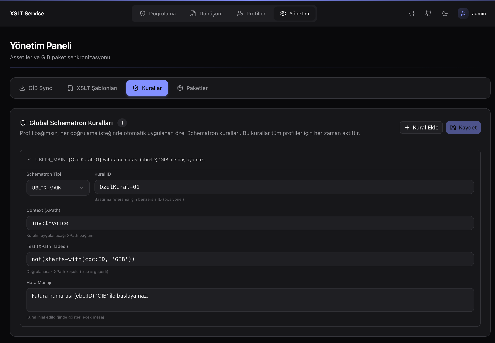
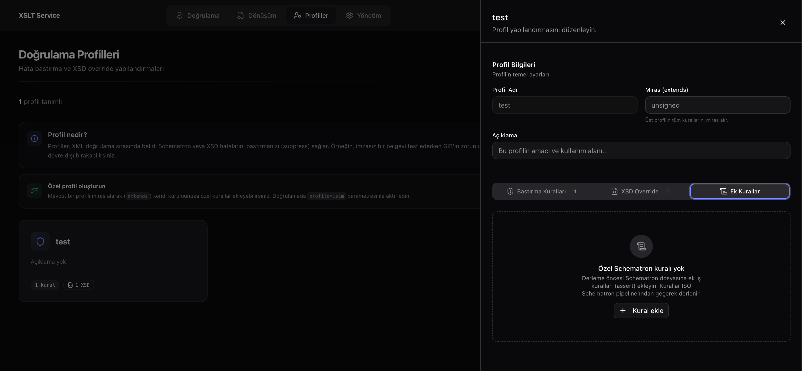
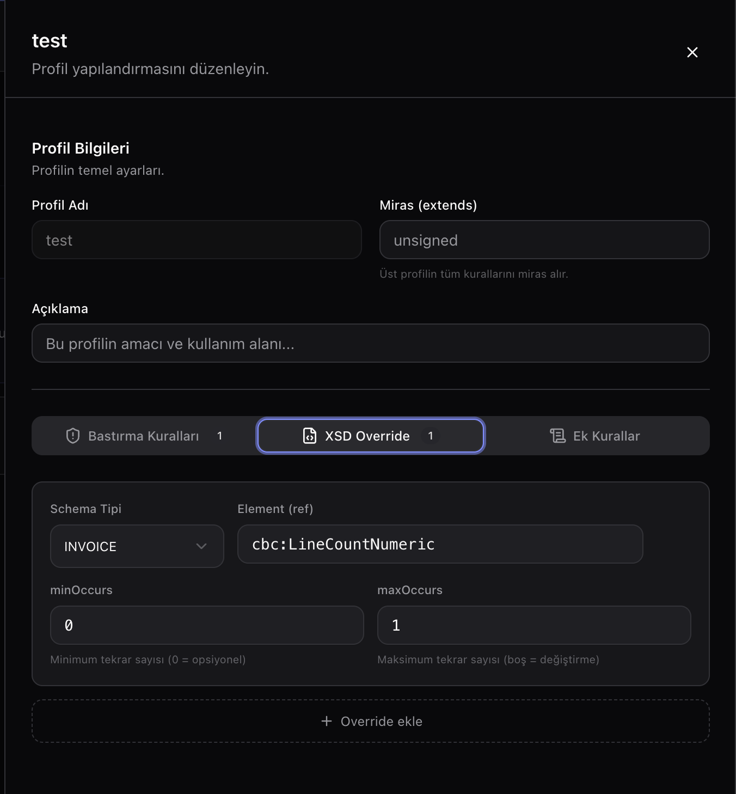
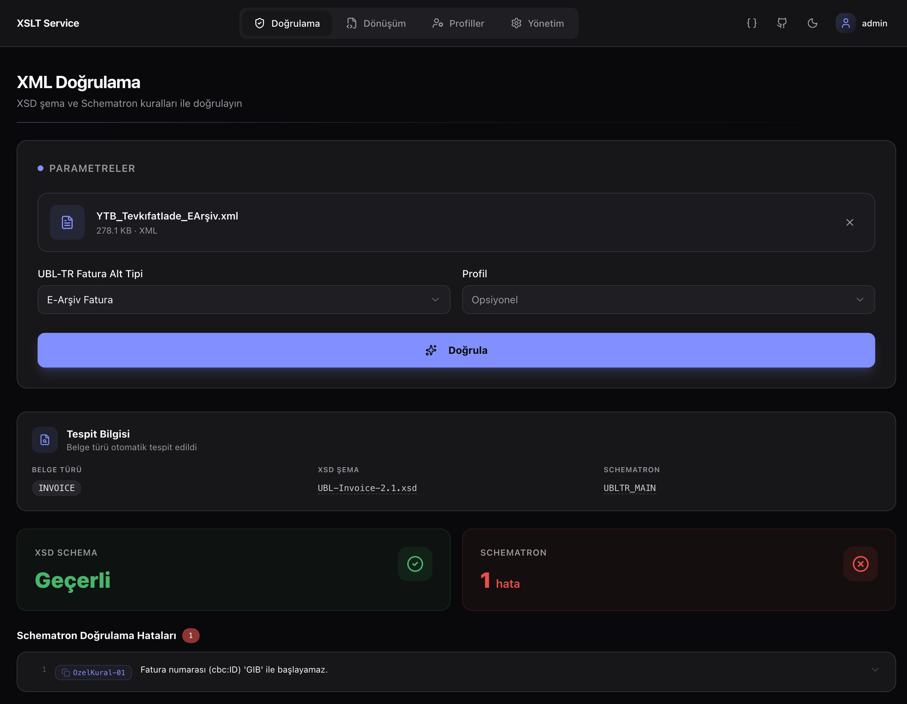
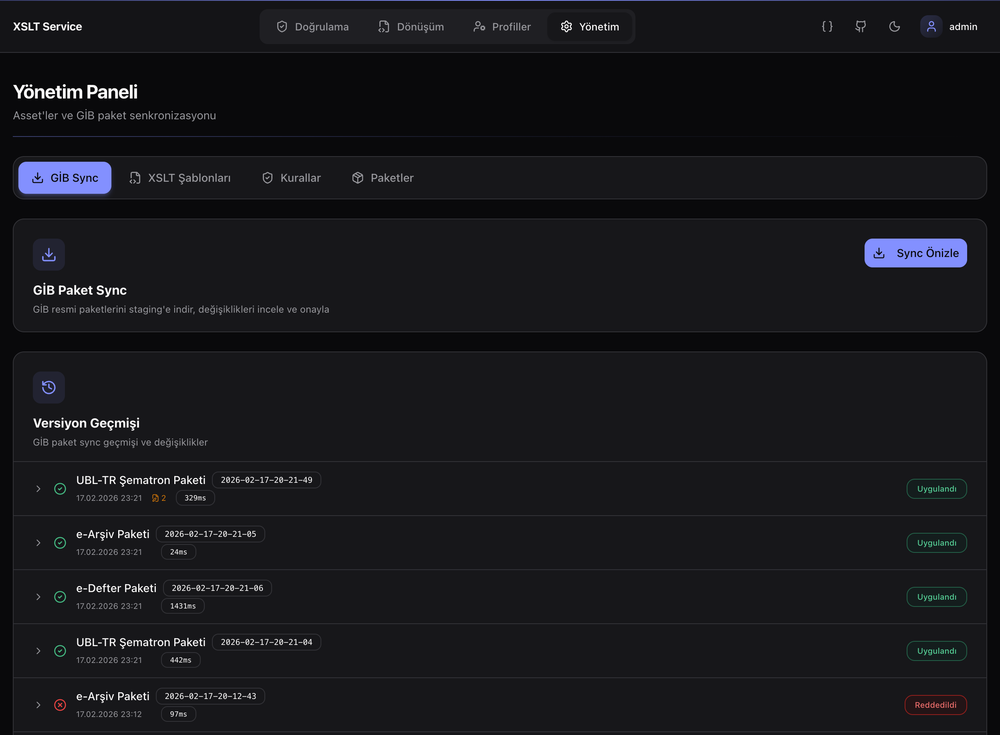
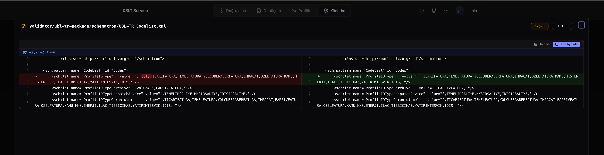
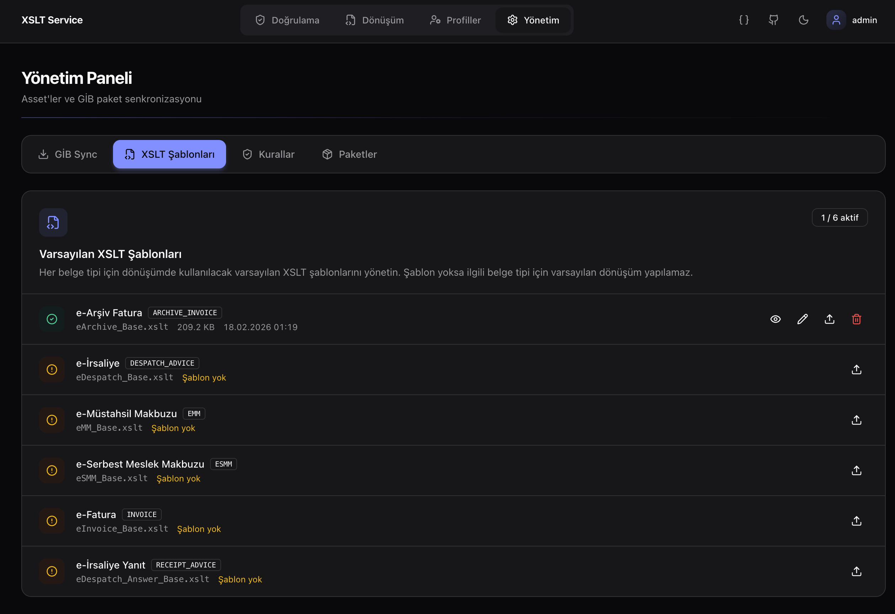
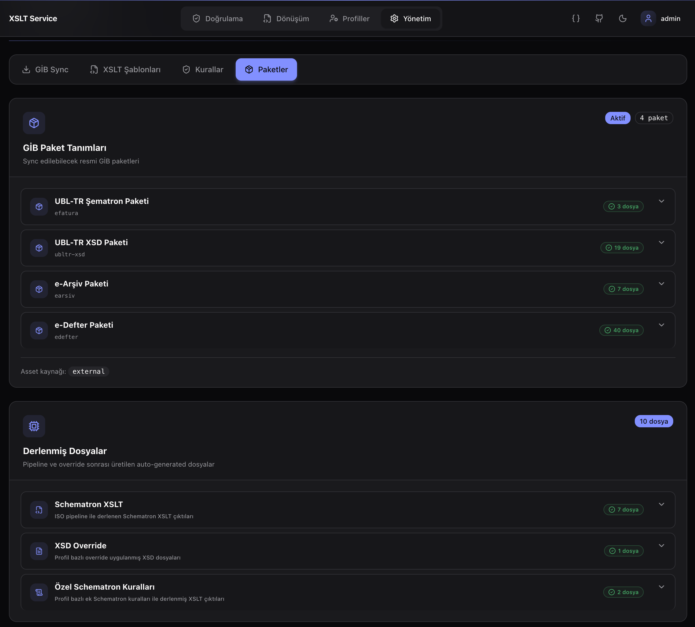
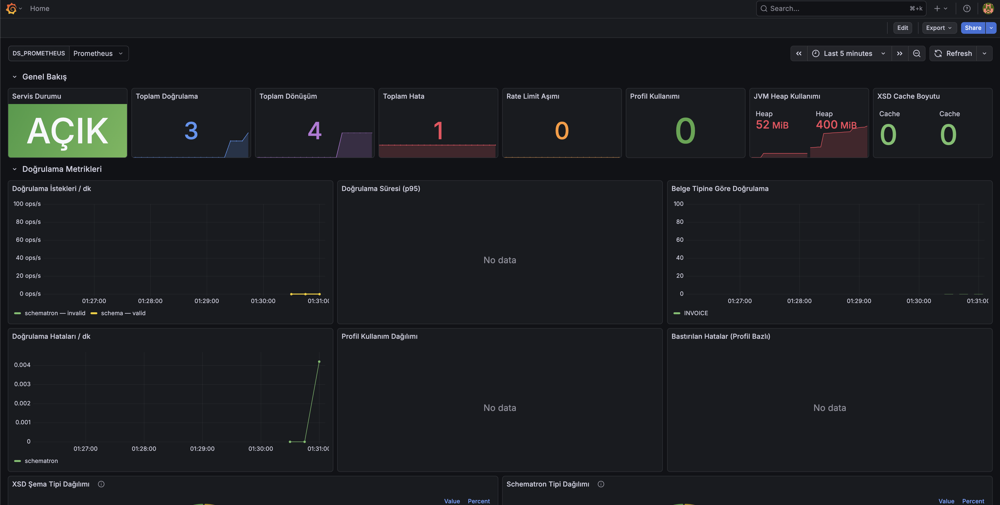

# Ekran Görüntüleri

## v1.1.0

### Özel Schematron Kuralları

Global Schematron kuralları yönetim ekranı. Profil bağımsız, tüm doğrulamalarda otomatik aktif olan özel iş kuralları tanımlanabilir. Örneğin: "Fatura numarası GIB ile başlayamaz" kuralı `OzelKural-01` ID'si ile ekleniyor.



### Doğrulama Profilleri — Ek Kurallar

Profil editöründe "Ek Kurallar" tab'ı. Mevcut bir profili miras alarak (`extends`) profil bazlı Schematron kuralları eklenebilir. Kurallar global kurallarla birleştirilerek ISO Schematron pipeline'a enjekte edilir.



### Doğrulama Profilleri — XSD Override

Profil editöründe "XSD Override" tab'ı. Belge tipine göre XSD element kısıtlamaları (minOccurs, maxOccurs) özelleştirilebilir. Örnekte INVOICE tipi için `cbc:LineCountNumeric` elementi opsiyonel yapılmış.



### Özel Kuralın Doğrulamada Çalışması

Eklenen `OzelKural-01` kuralının gerçek bir doğrulamada çalışması. XSD Schema geçerli, Schematron'dan 1 hata dönmüş: "Fatura numarası (cbc:ID) 'GIB' ile başlayamaz." Kural ID (`OzelKural-01`) suppression için kullanılabilir.



---

### GİB Paket Sync & Versiyon Geçmişi

GİB Sync tab'ı — Paketlerin staging'e indirilmesi, versiyon geçmişi ve onay/reddetme akışı. Her versiyon zaman damgalı ID ile (ör: `2026-02-17-20-21-49`) saklanır. Dosya değişiklik sayısı ve süre bilgisi görüntülenir.



### Dosya Diff — Side by Side Görünüm

Onaylanan bir versiyon detayında dosya bazlı diff. Side-by-Side modunda eski ve yeni içerik yan yana gösterilir, karakter bazlı değişiklikler vurgulanır. Örnekte `UBL-TR_Codelist.xml` dosyasında "TEST" ifadesinin eklendiği görülüyor.



---

### Varsayılan XSLT Şablonları

"XSLT Şablonları" tab'ı. Her belge tipi (e-Arşiv Fatura, e-İrsaliye, e-MM, e-SMM, e-Fatura, e-İrsaliye Yanıt) için varsayılan XSLT şablonunun durumu listelenir. Mevcut şablonlar için görüntüleme, düzenleme, değiştirme ve silme; eksik şablonlar için yükleme butonları sunulur.



---

### GİB Paket Tanımları & Derlenmiş Dosyalar

"Paketler" tab'ı. Sync edilebilecek GİB paketleri (UBL-TR Şematron, UBL-TR XSD, e-Arşiv, e-Defter) ve pipeline sonrası üretilen auto-generated dosyalar (Schematron XSLT, XSD Override, Özel Schematron Kuralları) listelenir.



---

### Grafana Dashboard

Prometheus metrikleri ile beslenen Grafana dashboard. Servis durumu, toplam doğrulama/dönüşüm sayısı, hata oranı, rate limit, JVM heap kullanımı, XSD cache, belge tipine göre doğrulama dağılımı ve Schematron tipi dağılımı izlenebilir.



---

## Görsel Ekleme Rehberi

1. Ekran görüntüsünü alın (PNG veya JPG formatında)
2. Dosyayı `docs/screenshots/` klasörüne kopyalayın
3. Bu dosyaya markdown ile referans ekleyin:
   ```
   
   ```
4. Commit & push

**Önerilen boyut**: Genişlik 1200-1600px, PNG formatı.
